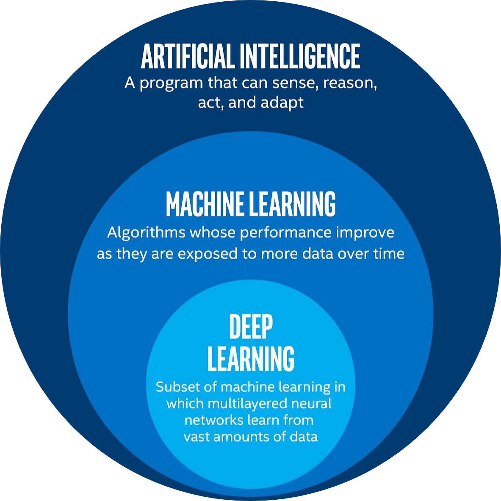

# Artificial Intelligence

[__Artificial Intelligence (AI)__](https://en.wikipedia.org/wiki/Artificial_intelligence) is a field of computer science and technology focused on creating intelligent machines capable of performing tasks that typically require human intelligence. It involves training computers to mimic human cognitive functions such as problem-solving, learning, reasoning, language understanding, pattern recognition, and decision-making. 

At its core, AI is about teaching computers to **think and act smart**. Instead of following rigid instructions, AI systems learn from **data and experiences** to improve their performance over time.

 

## Machine Learning

[__Machine learning__](https://en.wikipedia.org/wiki/Machine_learning) is a subfield of artificial intelligence (AI) that focuses on the development of algorithms and statistical models that enable computers to perform tasks without explicit instructions. 

In machine learning, systems are designed to 
- learn from data, 
- identify patterns, and 
- make decisions or predictions based on that data.

The core idea behind machine learning is to enable computers to learn from experience, just like humans do, but at a much larger scale and with computational efficiency. Instead of being explicitly programmed to perform a task, machine learning algorithms are trained on large datasets to recognize patterns and relationships within the data. These algorithms then use this learned knowledge to make predictions or decisions when presented with new, unseen data.

## Categories of Machine Learning

 

  

| **Categories**  | **Description** | **Key Characteristics** | **Common Applications** |
|----------------------|----------------|-------------------------|-------------------------|
| [**Supervised Learning**](https://en.wikipedia.org/wiki/Supervised_learning) | The algorithm is trained on labeled data, where each input has a corresponding output. | - Requires labeled data - Learns from examples - Used for classification & regression | Regression, Image classification, speech recognition, spam detection |
| [**Unsupervised Learning**](https://en.wikipedia.org/wiki/Unsupervised_learning) | The algorithm is trained on unlabeled data and identifies patterns or structures. | - No labeled data - Finds hidden patterns - Used for clustering & dimensionality reduction | Customer segmentation, anomaly detection, recommendation systems |
| [**Reinforcement Learning**](https://en.wikipedia.org/wiki/Reinforcement_learning) | An agent learns by interacting with an environment and receiving rewards or penalties. | - Learns through trial & error - Uses reward signals - Focuses on decision-making | Robotics, self-driving cars, game playing (e.g., AlphaGo) | 

