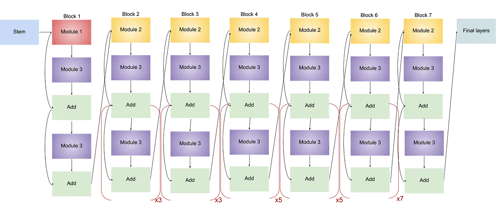

## PyTorch Lightning CNN & Custom Data Implementation



### Installing Dependencies

Before we begin, let's ensure we have the necessary dependencies installed. You can install them using pip:

```bash
pip install gdown pytorch-lightning efficientnet-pytorch
```

>_Note: Module `torch` is required before training the model. To check the installed module do `pip freeze`. If you haven't installed `torch` module, [click here](https://pytorch.org/)_

### Download Datasets

To begin, we need to download and extract the `Food_dataset.zip` file from Google Drive. We'll utilize the `gdown` library to download the file and `zipfile` to extract its contents. Here's the Python code for this:

```python
""" Download and Extract Food_dataset.zip from google drive"""
import gdown
import zipfile
import os

file_url = "https://drive.google.com/uc?id=1J0syU84FNmtxkf9AzDPdRSDmtUr1CSy8"
file_name = "Food_dataset.zip"

# Download the file from google drive
gdown.download(file_url, file_name, quiet=False)
extract_dir = './dataset'

# Extract the zip file
with zipfile.ZipFile(file_name, 'r') as zip_ref:
    zip_ref.extractall(extract_dir)

# Remove the zip file after extraction
os.remove(file_name)
print("Files extracted successfully to:", extract_dir)
```

### Training Hyperparameters

| Hyperparameter  | Description                                   | Default Value |
|-----------------|-----------------------------------------------|---------------|
| gpus            | Number of GPUs per node                      | 1             |
| data_workers    | Number of data loading workers                | 0             |
| train_dir       | Folder path to load training data            | None (required)|
| test_dir        | Folder path to load testing data             | None (required)|
| epochs          | Number of total epochs to run                | 10            |
| batch_size      | Size of batch                                 | 64            |
| precision       | Precision (e.g., 16 for mixed precision)     | 16            |

### Train Command

Now, let's initiate the training process with the following command. This example sets the number of `epochs` to 50 and adjusts the `batch_size` to 128:

```python
py train.py --train_dir "dataset/train" --test_dir "dataset/test" --epochs 50 --batch_size 128
```
