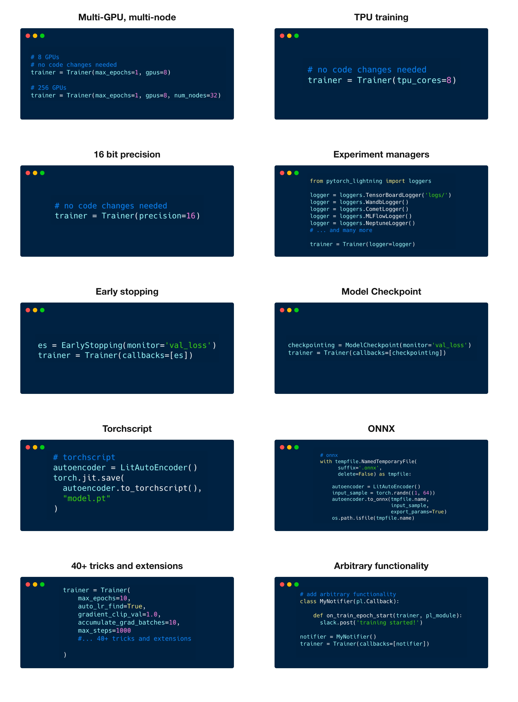

# ⚡ PyTorch Lightning 

  

PyTorch Lightning is a powerful deep learning framework designed for professional AI researchers and machine learning engineers. It provides maximal flexibility without sacrificing performance at scale, making it ideal for projects ranging from initial experimentation to production deployment. This comprehensive guide will cover the fundamental concepts of PyTorch Lightning, enabling you to leverage its capabilities effectively.
  
## Why ⚡ PyTorch Lighting???





## Getting Started

Before diving into PyTorch Lightning, it's essential to have a solid understanding of PyTorch, a popular deep learning framework in Python. PyTorch Lightning builds upon PyTorch's foundation, providing additional abstractions and functionalities for streamlined development and scalability.

_If you're new to PyTorch or need to refresh your knowledge, consider reviewing PyTorch tutorials to reinforce your understanding. [Click here](https://github.com/LuluW8071/Data-Science/tree/main/Pytorch) to access the tutorials._

Create a virtual environment for your PyTorch Lightning project to manage dependencies effectively and install **PyTorch Lightning** via pip or conda. Make sure to install a compatible version based on your PyTorch installation.

```bash
# With pip
pip install pytorch-lightning

# With conda
conda install pytorch-lightning -c conda-forge
```

## Concepts Covered

| Concept                           | Description                                                                                                 |
|-----------------------------------|-------------------------------------------------------------------------------------------------------------|
| PyTorch Basic Implementation     | Create a basic PyTorch Neural Network and train MNIST Dataset on it   |
| PyTorch Lightning Module         | Learn how to structure your deep learning models using LightningModules, separating model architecture from training logic. |
| Trainer                          | Explore the Trainer class for efficient model training, providing features like distributed training and mixed precision. |
| Metrics                          | Understand how to define, track, and evaluate training metrics to assess model performance effectively.       |
| Data Module                         | Dive into data loading and preprocessing techniques in PyTorch Lightning, leveraging DataLoader and transforms for efficient data handling. |
| Code Structure                   | Restructuring single script to modular form: `dataset.py`, `model.py`, `config.py`, `train.py`. |
| Callbacks                        | Discover the flexibility and extensibility of PyTorch Lightning through custom callbacks, enabling additional functionalities during training. |
| TensorBoard                      | Learn how to visualize training metrics and model graphs using TensorBoard integration in PyTorch Lightning, facilitating deeper insights into model behavior. |
| Profiler                         | Explore the built-in profiler in PyTorch Lightning for performance optimization, identifying bottlenecks and optimizing training pipelines. |
| Multi-GPU Training               | Understand how to leverage multiple GPUs for accelerated training with PyTorch Lightning, scaling up training performance for large-scale models. |     

_Please note that the tutorial follows training on the MNIST dataset, starting from basic PyTorch implementation and gradually progressing through previous scripts, leading us deeper into implementation of PyTorch Lightning AI._

## Material Availability

All the materials discussed in the repository are available for reference and practice. You can follow along with the provided code examples and experiment with your own datasets as well.

---

Happy coding! 
